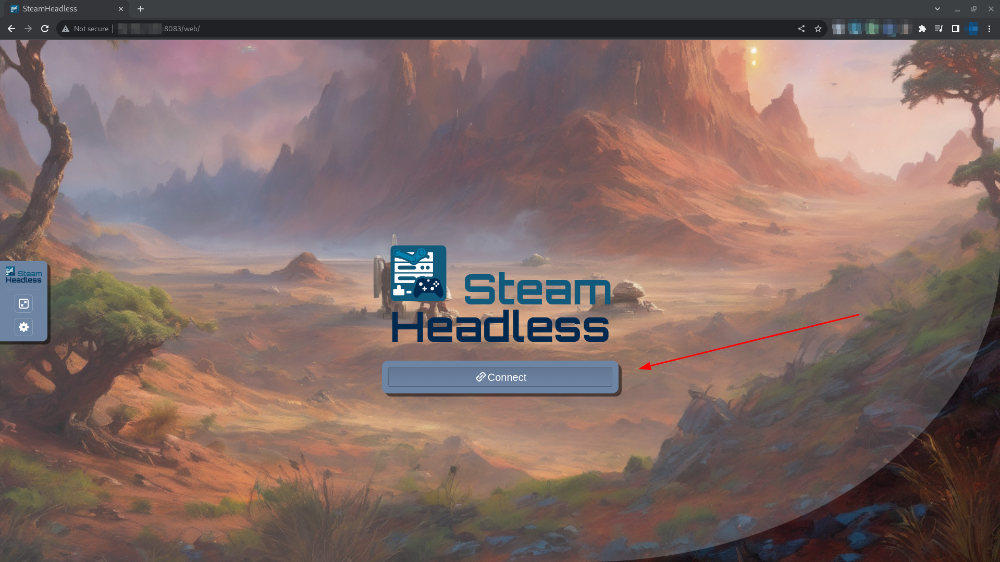

# Docker Compose

Follow these instructions to configure a docker-compose.yml for your system.

> __Note__
>
> These instructions assume that you have docker and docker-compose installed for your system.
> 
> Depending on how you have installed this, the commands to execute docker compose may vary.


## PREPARE DIRECTORIES:

> __Warning__
>
> These commands are meant to be run as your user. Do not run them as root.
> 
> If you do run these commands as root, you may need to manually fix the permissions and ownership after.

Create a directory for your service:
```shell
sudo mkdir -p /opt/container-services/steam-headless
sudo chown -R $(id -u):$(id -g) /opt/container-services/steam-headless
```

Create a directory for your service config data:
```shell
sudo mkdir -p /opt/container-data/steam-headless/{home,.X11-unix,pulse}
sudo chown -R $(id -u):$(id -g) /opt/container-data/steam-headless
```

(Optional) Create a directory for your game install location:
```shell
sudo mkdir /mnt/games
sudo chmod -R 777 /mnt/games
sudo chown -R $(id -u):$(id -g) /mnt/games
```

Create a Steam Headless `/opt/container-services/steam-headless/docker-compose.yml` file.

Populate this file with the contents of the default [Docker Compose File](./compose-files/docker-compose.default.yml).


## CONFIGURE ENV:

Create a Steam Headless `/opt/container-services/steam-headless/.env` file with the contents found in this example [Environment File](./compose-files/.env).

Edit these variables as required.

## EXECUTE:

Navigate to your compose location and execute it.
```shell
cd /opt/container-services/steam-headless
sudo docker-compose up -d --force-recreate
```

After container executes successfully, navigate to your docker host URL in your browser on port 8083 and click connect.
`http://<host-ip>:8083/`

