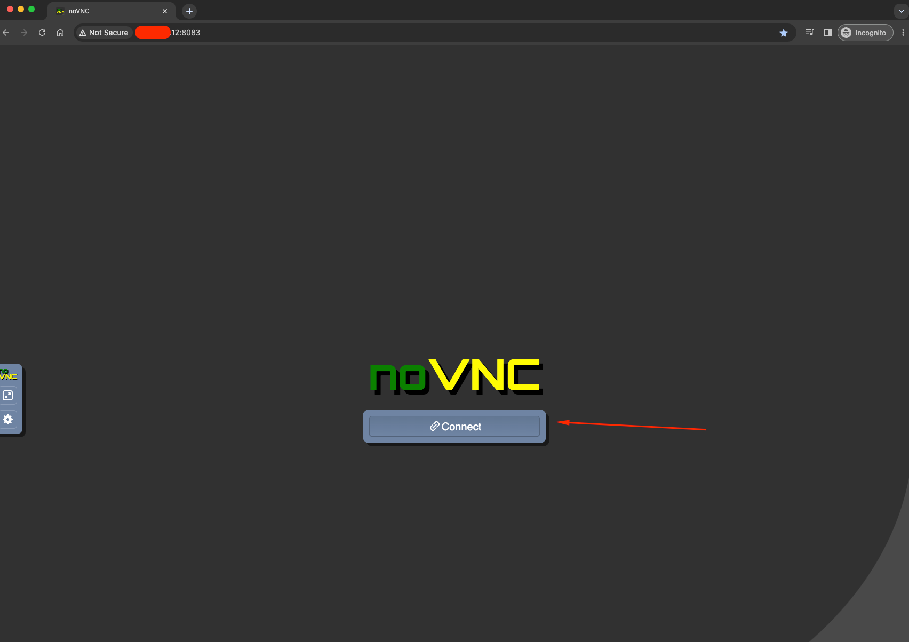

# Docker Compose

Follow these instructions to configure a docker-compose.yml for your system.

> __Note__
>
> These instructions assume that you have docker and docker-compose installed for your system.
> 
> Depending on how you have installed this, the commands to execute docker compose may vary.


## PREPARE DIRECTORIES:

> __Warning__
>
> These commands are meant to be run as your user. Do not run them as root.
> 
> If you do run these commands as root, you may need to manually fix the permissions and ownership after.

Create a directory for your service:
```shell
sudo mkdir -p /opt/container-services/steam-headless
sudo chown -R $(id -u):$(id -g) /opt/container-services/steam-headless
```

Create a directory for your service config data:
```shell
sudo mkdir -p /opt/container-data/steam-headless/{home,.X11-unix,pulse}
sudo chown -R $(id -u):$(id -g) /opt/container-data/steam-headless
```

(Optional) Create a directory for your game install location:
```shell
sudo mkdir /mnt/games
sudo chmod -R 777 /mnt/games
sudo chown -R $(id -u):$(id -g) /mnt/games
```

Create a Steam Headless `/opt/container-services/steam-headless/docker-compose.yml` file.

Populate this file with the contents of the default [Docker Compose File](./compose-files/docker-compose.default.yml).


## CONFIGURE HOST:

It is recommended that you configure this container to use a Macvlan network. If you know what you are doing, you can also use an IPvlan or Host, but I will not be covering that setup in this documentation.

To simplify the setup process and allow you to reuse the created Macvlan for other containers, we will create this Macvlan manually rather than have Docker compose handle it. If you know what you are doing with Docker compose and you would rather have the Macvlan managed there, feel free to do so. Otherwise run this command and carry on with the setup:

### 1) Discover your parent network:
To find the parent network device, run the command `ip address show`. Find the device that has the IP address of your Host server.
```
root@Tower:~# ip address show
1: lo: <LOOPBACK,UP,LOWER_UP> mtu 65536 qdisc noqueue state UNKNOWN group default qlen 1000
    link/loopback 00:00:00:00:00:00 brd 00:00:00:00:00:00
    inet 127.0.0.1/8 scope host lo
       valid_lft forever preferred_lft forever
    inet6 ::1/128 scope host 
       valid_lft forever preferred_lft forever
2: tunl0@NONE: <NOARP> mtu 1480 qdisc noop state DOWN group default qlen 1000
    link/ipip 0.0.0.0 brd 0.0.0.0
3: eth0: <BROADCAST,MULTICAST,PROMISC,UP,LOWER_UP> mtu 1500 qdisc fq master br0 state UP group default qlen 1000
    link/ether 7c:11:a9:b1:15:b9 brd ff:ff:ff:ff:ff:ff
4: eth0.1@eth0: <BROADCAST,MULTICAST,PROMISC,UP,LOWER_UP> mtu 1500 qdisc noqueue master br0.1 state UP group default qlen 1000
    link/ether 7c:11:a9:b1:15:b9 brd ff:ff:ff:ff:ff:ff
5: eth0.3@eth0: <BROADCAST,MULTICAST,PROMISC,UP,LOWER_UP> mtu 1500 qdisc noqueue master br0.3 state UP group default qlen 1000
    link/ether 7c:11:a9:b1:15:b9 brd ff:ff:ff:ff:ff:ff
6: br0: <BROADCAST,MULTICAST,UP,LOWER_UP> mtu 1500 qdisc noqueue state UP group default qlen 1000
    link/ether 7c:11:a9:b1:15:b9 brd ff:ff:ff:ff:ff:ff
    inet 192.168.1.43/24 brd 192.168.1.255 scope global dynamic noprefixroute br0
       valid_lft 440sec preferred_lft 365sec
```
In this example output, I will select br0 as the parent network device which has the IP address of "192.168.1.43".

### 2) Create a macvlan Docker network
```
# Set the parent network device.
NETWORK_PARTENT=br0
# Name this whatever you like, but ensure you update the `.env` file below to match.
NETWORK_NAME=steam-headless-vlan
# Choose a network subnet and gateway that matches your host network
NETWORK_SUBNET=192.168.1.0/24
NETWORK_GATEWAY=192.168.1.1
# Execute the docker network create command
sudo docker network create -d macvlan \
    --subnet=${NETWORK_SUBNET:?} \
    --gateway=${NETWORK_GATEWAY:?} \
    -o parent=${NETWORK_PARTENT:?} \
    ${NETWORK_NAME:?}
```


## CONFIGURE ENV:

Create a Steam Headless `/opt/container-services/steam-headless/.env` file with the contents found in this example [Environment File](./compose-files/.env).

Edit these variables as required.

## EXECUTE:

Navigate to your compose location and execute it.
```shell
cd /opt/container-services/steam-headless
sudo docker-compose up -d --force-recreate
```

After container executes successfully, navigate to your docker host URL in your browser on port 8083 and click connect.
http://<host-ip>:8083/


If using a `/mnt/games` volume mount, wait until Steam installs and executes, then restart the container. This step
is necessary to create the required steamapps folder in the /mnt/games volume after initial installation. If this
doesn't occur, you will receive a "disk write error" when trying to install to this location. 
