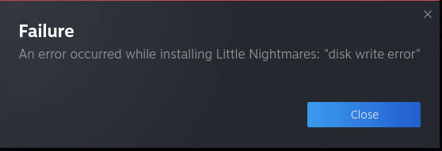

## Flatpaks not working

Steam runs with Flatpak. These Flatpaks are instlled into the `default` user's home directory so they persist between container updates. Sometimes Flatpaks can get into a knot between major Steam Headless updates. In such cases, it may not work correctly. To fix this, just delete the Flatpak runtime in your `default` user's home directory a restart the container.

1) Stop the container.
2) Delete the directory `<SteamHeadless Home>/.local/share/flatpak`
3) Re-create the container. Don't just restart it. This will trigger an update of the required Flatpak runtimes in the home directory.
4) Reinstall any missing Flatpaks from the Software app.

Once your Flatpak refresh is complete, everything should work correctly and your configuration for each application should have remained intact.

## An error occurred while installing <game>: "disk write error"



1) Stop the container
2) Verify your mounted /mnt/games volume is owned by the executing UID/GID, and 777 permissions are set.
3) Verify the `steamapps` directory exists within the library location. 

> __Note__
>
> The directory in the below commands are the default /mnt/games library locations installed upon first execution of this container.
> 
> Depending on how you have installed this, the directory path may vary.

```shell
sudo mkdir /mnt/games/GameLibrary/SteamLibrary/steamapps
sudo chmod -R 777 /mnt/games
sudo chown -R $(id -u):$(id -g) /mnt/games
```
