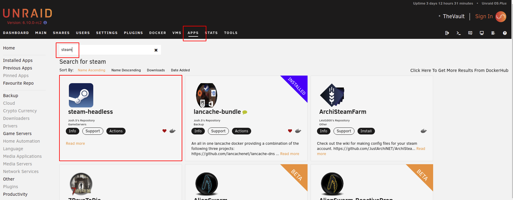
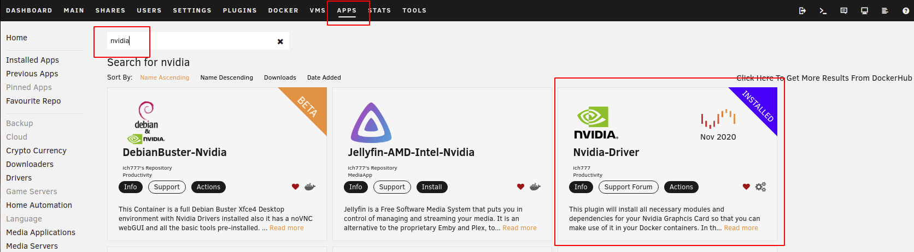
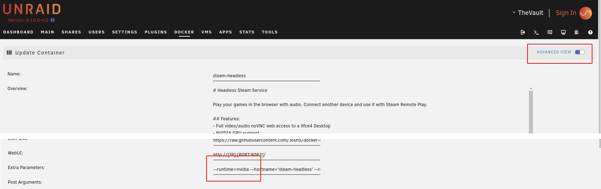
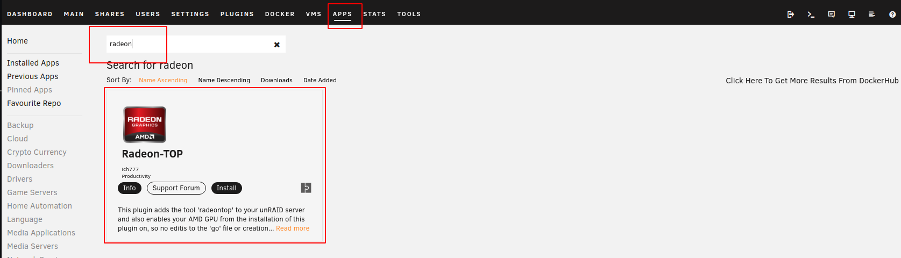
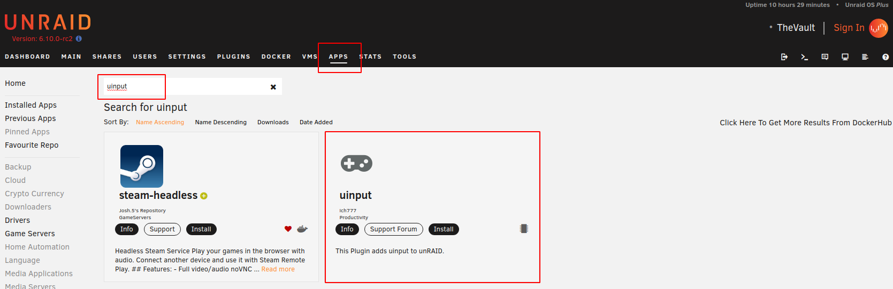
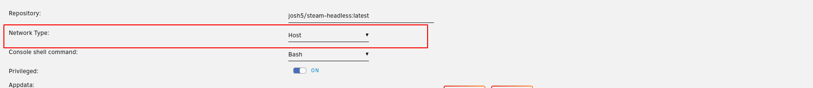

## CONTAINER TEMPLATE:

1. Navigate to "**APPS**" tab.
2. Search for "*steam-headless*"
3. Select either **Install** or **Actions > Install** from the search result.

4. Configure the template as required.

## GPU CONFIGURATION:

This container can use your dedicated GPU. 
In order for it to do this you need to have either the Nvidia-Driver or Radeon-Top plugin installed.

### NVIDIA

1. Install the [Nvidia-Driver Plugin](https://forums.unraid.net/topic/98978-plugin-nvidia-driver/) by [ich777](https://forums.unraid.net/profile/72388-ich777/). This will maintain an up-to-date NVIDIA driver installation on your Unraid server.

2. Toggle the steam-headless Docker Container template editor to "**Advanced View**".
3. In the "**Extra Parameters**" field, ensure that you have the "--runtime=nvidia" parameter added.

4. (Optional - This step is only necessary if you only multiple NVIDIA GPUs. If you have a single GPU, then leaving this as "all" is fine.) Expand the **Show more settings...** section near the bottom of the template. In the **Nvidia GPU UUID**: (NVIDIA_VISIBLE_DEVICES) variable, copy your GPU UUID (can be found in the Unraid Nvidia Plugin. See that forum thread for details).

### AMD

1. Install the [Radeon-Top Plugin](https://forums.unraid.net/topic/92865-support-ich777-amd-vendor-reset-coraltpu-hpsahba/) by [ich777](https://forums.unraid.net/profile/72388-ich777/).

2. Profit

## ADDING CONTROLLER SUPPORT:

Unraid's Linux kernel by default does not have the modules required to support controller input. Steam requires these modules to be able to create the virtual "Steam Input Gamepad Emulation" device that it can then map buttons to.

[ich777](https://forums.unraid.net/profile/72388-ich777/) has kindly offered to build and maintain the required modules for the Unraid kernel as he already has a CI/CD pipeline in place and a small number of other kernel modules that he is maintaining for other projects. So a big thanks to him for that!

> __Note__
>
> This may no longer be required with Unraid v6.11 release (TBD). The required uinput module should be added to the kernel for that release.

1. Install the **uinput** plugin from the **Apps** tab.

2. The container will not be able to receive kernel events from the host unless the **Network Type:** is set to "*host*". Ensure that you container is configured this way.

    > __Warning__
    >
    > Be aware that, by default, this container requires at least 8083, 5900, 5901, 32123, and 2222 available for the WebUI, VNC, Web Audio, and SSH to work. It will also require any ports that Steam requires for Steam Remote Play.

    You can override the default ports used by the container with these variables:
    - PORT_SSH (Default: 2222)
    - PORT_VNC (Default: 5900)
    - PORT_AUDIO_STREAM (Default: 5901)
    - PORT_NOVNC_WEB (Default: 8083)
    - PORT_AUDIO_WEBSOCKET (Default: 32123)

3. No server restart is required, however. Ensure that the **steam-headless** Docker container is recreated after installing the **uinput** plugin for it to be able to detect the newly added module.
